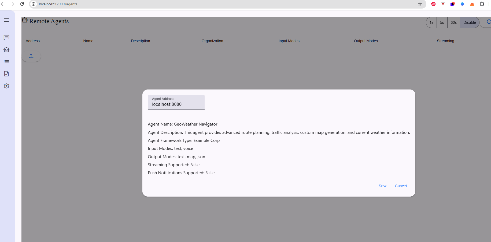
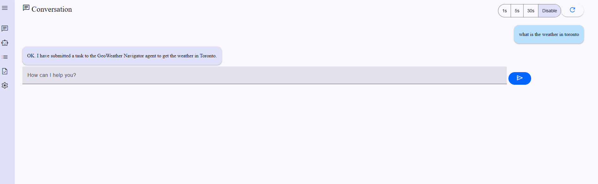
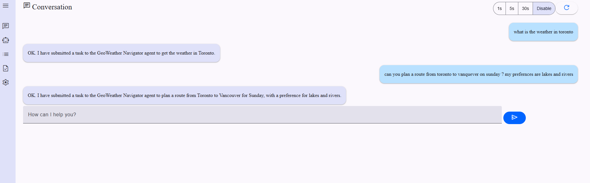
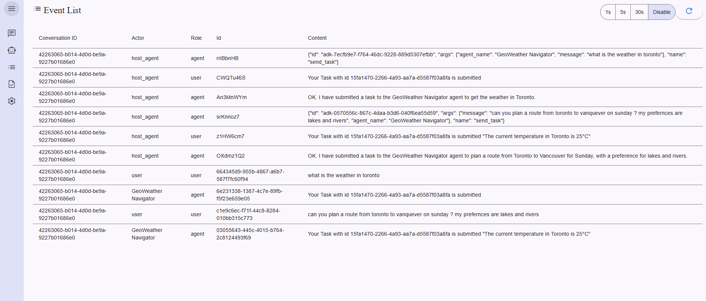

# Building Smart Agent-to-Agent (A2A) Applications with Kotlin

In this comprehensive guide, we'll explore how to create intelligent agents using the A2A (Agent-to-Agent) protocol in Kotlin. We'll build a practical example that demonstrates how agents can communicate and work together to solve complex tasks.

## What is the A2A Protocol?

The Agent-to-Agent (A2A) protocol is a modern approach to building distributed AI-powered applications. It provides a standardized way for software agents to communicate and delegate tasks, making it easier to create scalable and modular AI systems.

Key features of the A2A protocol include:
- Standardized communication between agents
- Dynamic task delegation based on agent capabilities
- Support for both synchronous and asynchronous operations
- Extensible architecture for adding new agents and capabilities

## Setting Up Your A2A Project

Let's start by creating a new Kotlin project with the necessary dependencies. We'll use Spring Boot and the a2ajava library.

```kotlin
plugins {
    kotlin("jvm") version "2.1.0"
    kotlin("plugin.spring") version "2.1.0"
    id("org.springframework.boot") version "3.2.5"
}

dependencies {
    implementation("io.github.vishalmysore:a2ajava:0.0.7.9")
    implementation("org.springframework.boot:spring-boot-starter-web")
}
```

## Creating Your First Agent

Let's create a simple WeatherAgent that provides weather information:



```kotlin
@Agent(groupName = "Weather Service", groupDescription = "Provides current weather info")
open class WeatherAgent {
    @Action(description = "Get temperature for a given city")
    fun getTemperature(city: String): String {
        return "The current temperature in $city is 25°C"
    }
}
```

The `@Agent` annotation defines our agent's identity and capabilities, while `@Action` marks methods that other agents can invoke.

## Setting Up the Server

To make our agents accessible, we need to set up a server. Here's our main application class:

```kotlin
@SpringBootApplication
class A2AKotlinApp

fun main(args: Array<String>) {
    runApplication<A2AKotlinApp>(*args)
    var client = LocalA2ATaskClient()
    var response = client.sendTask("hows the weather in London")
    println("Response: $response")
}
```

## Real-Time Agent Communication

One of the powerful features of A2A is real-time communication between agents. Here's how agents interact:



When agents communicate, they can:
1. Exchange structured messages
2. Delegate tasks
3. Share results and status updates

## Advanced Agent Interactions

Agents can have complex conversations and handle multiple tasks:



## Monitoring Agent Events

The A2A protocol provides built-in support for monitoring agent activities:



This helps in:
- Tracking task execution
- Monitoring agent performance
- Debugging agent interactions

## Adding More Complex Agents

Let's look at a more sophisticated agent that handles route planning:

```kotlin
@Agent(
    groupName = "GeoSpatial Route Planner Agent",
    groupDescription = "Provides advanced route planning services"
)
class RoutePlanner {
    @Action(description = "Calculates optimal route between two locations")
    fun planOptimalRoute(origin: String, destination: String): String {
        return "Optimal route from $origin to $destination calculated."
    }
}
```

## Best Practices for A2A Development

1. **Agent Design**
   - Keep agents focused on specific domains
   - Use clear and descriptive action names
   - Implement proper error handling

2. **Communication**
   - Use structured data formats
   - Implement timeouts for synchronous operations
   - Handle communication failures gracefully

3. **Testing**
   - Test agents in isolation
   - Verify agent interactions
   - Monitor performance metrics

## Deploying A2A Applications

To deploy your A2A application:

1. Build the application:
   ```bash
   ./gradlew build
   ```

2. Run the server:
   ```bash
   ./gradlew bootRun
   ```

Your agents will be available at:
- Server: `http://localhost:8080`
- Agent Card: `http://localhost:8080/.well-known/agent.json`

## Conclusion

The A2A protocol provides a powerful framework for building intelligent, distributed applications. By following this guide, you've learned how to:
- Create intelligent agents in Kotlin
- Set up agent communication
- Monitor agent activities
- Deploy A2A applications

The combination of Kotlin's expressiveness and A2A's powerful features makes it easy to build sophisticated agent-based systems that can solve complex real-world problems.

## Resources

- [Project Source Code](https://github.com/yourusername/a2a-kotlin)
- [A2A Protocol Documentation](https://a2a-protocol.dev)
- [Spring Boot Documentation](https://spring.io/projects/spring-boot)